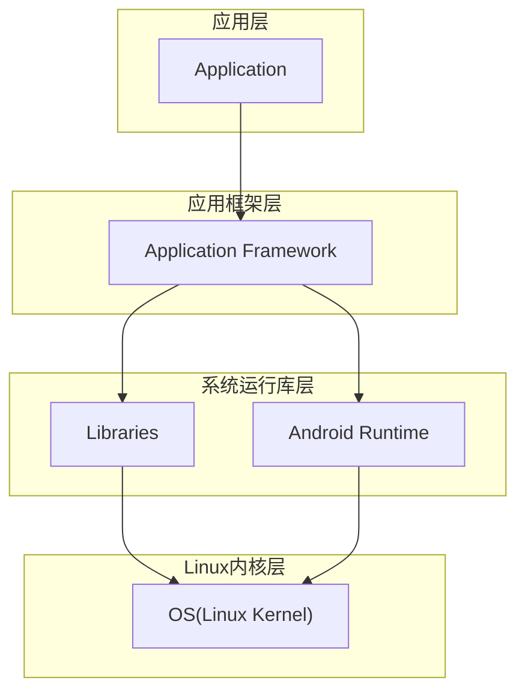

# Android

## Android系统架构

```mermaid
graph TB
    section1["Application"]
    section2["Application Framework"]
    section3["Libraries"]
    section4["Android Runtime"]
    section5["OS(Linux Kernel)"]
    subgraph 应用层
        section1
    end
    subgraph 应用框架层
        section2
    end
    subgraph 系统运行库层
        section3
        section4
    end
    subgraph Linux内核层
        section5
    end
    section1-->section2-->section3 & section4-->section5
```
